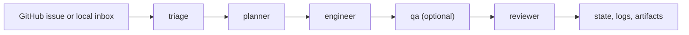

<div align="center">
  <h1>RepoRepublic</h1>
  <p><strong>어떤 저장소에도 AI 유지보수 팀을 설치하세요.</strong></p>
  <p>Codex CLI, 저장소 로컬 역할 정의, 보수적인 안전 기본값으로 운영하는 이슈 중심 저장소 오케스트레이션 프레임워크입니다.</p>

  <p>
    <a href="./README.md">English</a> ·
    <a href="./QUICKSTART.ko.md">빠른 시작</a> ·
    <a href="./docs/README.ko.md">문서</a> ·
    <a href="./examples">예제</a>
  </p>

  <p>
    
    
    
    
    
    
  </p>
</div>

> RepoRepublic는 저장소 안에 프롬프트, 정책, 워크플로 스캐폴딩, 실행 상태를 설치하고, 일회성 채팅 문맥 대신 실제 이슈를 기준으로 `triage -> planner -> engineer -> reviewer` 파이프라인을 조정합니다.

RepoRepublic는 OpenAI Symphony의 운영 철학에서 영감을 받았지만, Symphony를 포함하거나 내장하거나 의존하지 않습니다. 이것은 Codex CLI를 기본 실행 백엔드로 사용하는 독립적인 Python 구현입니다.

## 왜 다르게 보이는가

| 일반적인 AI 코딩 도구 | RepoRepublic |
| --- | --- |
| 채팅 세션 최적화 | 지속적인 저장소 운영 최적화 |
| 저장소 밖에 지침이 흩어짐 | 역할, 프롬프트, 정책을 저장소 안에서 버전 관리 |
| 임시 요청에서 작업 시작 | 이슈, 로컬 inbox, 명시적 이벤트에서 작업 시작 |
| 대화가 끝나면 맥락이 사라짐 | 상태, 로그, Markdown 아티팩트가 남음 |
| 쓰기 동작을 쉽게 허용 | 사람 승인과 보수적 publish가 기본값 |

## 어떻게 동작하는가



- `republic init`이 저장소 로컬 control plane을 설치합니다.
- `republic run`이 Codex를 기본 worker runtime으로 사용해 이슈 루프를 실행합니다.
- `republic trigger`, `republic webhook`, `republic dashboard`가 이벤트 기반 실행과 운영 가시성을 담당합니다.

## 빠른 시작

### 1. 도구 설치

요구사항:

- Python 3.12+
- [uv](https://docs.astral.sh/uv/)
- `PATH`에서 실행 가능한 Codex CLI

```bash
git clone <your-fork-or-copy> RepoRepublic
cd RepoRepublic
uv sync --dev
codex --version
codex login
```

### 2. 대상 저장소 초기화

```bash
cd /path/to/your/repo
uv run republic init --preset python-library --tracker-repo owner/name
uv run republic doctor
```

유용한 초기화 변형:

- `uv run republic init`은 대화형 설정 흐름을 시작합니다.
- `uv run republic init --backend mock`은 deterministic mock backend를 기본값으로 심습니다.
- `uv run republic init --tracker-kind local_file --tracker-path issues.json`은 GitHub 대신 로컬 JSON inbox를 사용합니다.
- `uv run republic init --tracker-kind local_markdown --tracker-path issues`는 로컬 Markdown issue 디렉터리를 사용합니다.
- 로컬 오프라인 tracker는 `.ai-republic/sync/<tracker>/issue-<id>/` 아래에 publish proposal을 stage할 수 있습니다.
- 로컬 Markdown tracker는 쓰기가 켜져 있으면 publish 제안을 `.ai-republic/sync/local-markdown/issue-<id>/` 아래에 stage합니다.
- `uv run republic init --upgrade`는 로컬 managed 파일을 덮어쓰지 않고 scaffold drift를 점검합니다.

### 3. 첫 파이프라인 미리 실행

```bash
uv run republic run --dry-run
uv run republic run --once
uv run republic status
uv run republic dashboard
```

실운영 경로:

1. `llm.mode: codex`를 유지합니다.
2. `tracker.repo`를 실제 GitHub 저장소로 지정합니다.
3. `GITHUB_TOKEN`을 제공합니다.
4. `uv run republic run`을 실행합니다.

## `republic init`이 설치하는 것

```text
.ai-republic/
  reporepublic.yaml
  roles/
    triage.md
    planner.md
    engineer.md
    qa.md
    reviewer.md
  prompts/
    triage.txt.j2
    planner.txt.j2
    engineer.txt.j2
    qa.txt.j2
    reviewer.txt.j2
  policies/
    merge-policy.md
    scope-policy.md
  state/
    runs.json
AGENTS.md
WORKFLOW.md
.github/workflows/republic-check.yml
```

운영 모델이 저장소 안에 남기 때문에 유지보수자는 일반적인 코드 리뷰 방식으로 정책과 역할을 검토하고 수정할 수 있습니다.

## 데모 경로

예제들은 로컬 fixture issue와 mock backend를 기준으로 설계되어 있어서, 동작은 결정적이면서도 실운영 구조는 그대로 유지됩니다.

| 시나리오 | 명령 | 보여주는 것 |
| --- | --- | --- |
| Python 라이브러리 | `bash scripts/demo_python_lib.sh` | 초기화, dry-run, 단일 실행, 상태, 대시보드 전체 흐름 |
| Web app | `bash scripts/demo_web_app.sh` | 다른 preset에서 같은 control plane 적용 |
| Local file inbox | `bash scripts/demo_local_file_tracker.sh` | GitHub polling 없는 오프라인 JSON inbox |
| Local file sync | `bash scripts/demo_local_file_sync.sh` | 오프라인 JSON inbox와 staged sync proposal, `sync apply` |
| Local Markdown inbox | `bash scripts/demo_local_markdown_tracker.sh` | 완전 오프라인 Markdown issue 실행 |
| Local Markdown sync | `bash scripts/demo_local_markdown_sync.sh` | 오프라인 Markdown inbox와 comment, branch, label, draft PR 제안 stage |
| Docs maintainer pack | `bash scripts/demo_docs_maintainer_pack.sh` | repo-local role, prompt, policy, `AGENTS.md` override |
| QA role pack | `bash scripts/demo_qa_role_pack.sh` | optional `qa` 단계와 `qa.md`, `qa.json` artifact |
| Webhook receiver | `bash scripts/demo_webhook_receiver.sh` | GitHub 스타일 POST를 전달하는 로컬 HTTP receiver |
| Signed webhook receiver | `bash scripts/demo_webhook_signature_receiver.sh` | dispatch 전 `X-Hub-Signature-256` 검증 |
| Live GitHub ops | `bash scripts/demo_live_ops.sh` | GitHub REST mode, `worktree`, 파일 로그, timed dashboard reload |

<details>
<summary>수동 데모 walkthrough</summary>

```bash
cd examples/python-lib
uv run republic init --preset python-library --fixture-issues issues.json --tracker-repo demo/python-lib
python3 - <<'PY'
from pathlib import Path
path = Path(".ai-republic/reporepublic.yaml")
body = path.read_text()
path.write_text(body.replace("mode: codex", "mode: mock"))
PY
uv run republic doctor
uv run republic run --dry-run
uv run republic run --once
uv run republic status
uv run republic dashboard
```

</details>

## tracker와 실행 모드

| 모드 | 이런 경우 사용 | 메모 |
| --- | --- | --- |
| GitHub polling | 실제 저장소에서 지속적으로 이슈를 처리하고 싶을 때 | 기본 장기 실행 모드 |
| `local_file` | 로컬 JSON inbox가 필요할 때 | 결정적인 오프라인 데모와 `.ai-republic/sync/local-file/` 기반 handoff에 적합 |
| `local_markdown` | GitHub 대신 로컬 Markdown issue를 쓰고 싶을 때 | 완전 로컬 실행 경로이며 `.ai-republic/sync/local-markdown/`에 publish 제안 stage 가능 |
| `trigger` | 특정 이슈 하나를 즉시 실행하고 싶을 때 | polling loop를 기다리지 않음 |
| `webhook` | payload 기반 이벤트 실행이 필요할 때 | 먼저 `--dry-run`으로 검증 가능 |

staged local publish proposal을 보려면:

- `uv run republic sync ls --issue 1`
- `uv run republic sync check --issue 1`
- `uv run republic sync repair --issue 1 --dry-run`
- `uv run republic sync audit --format all`
- `uv run republic sync apply --issue 1 --tracker local-file --action comment --latest`
- `uv run republic sync apply --issue 1 --tracker local-markdown --action comment --latest`
- `uv run republic sync apply --issue 1 --tracker local-markdown --action pr-body --latest --bundle`
- `uv run republic sync show local-markdown/issue-1/<timestamp>-comment.md`
- `uv run republic clean --sync-applied --dry-run`

## 안전 기본값

- 머지 모드는 기본적으로 `human_approval`입니다.
- MVP는 auto-merge를 실행하지 않습니다.
- PR 열기는 기본적으로 비활성화되어 있습니다.
- `republic run --dry-run`은 외부 쓰기 없이 예상 파일, 정책 제약, 차단된 side effect를 미리 보여줍니다.
- 비밀정보성 파일, workflow 수정, 권한 민감 파일명, 대규모 삭제, planner 범위를 벗어난 코드 변경은 차단되거나 에스컬레이션됩니다.

## 문서

| 영역 | 영문 | 국문 |
| --- | --- | --- |
| 개요 | [README.md](./README.md) | [README.ko.md](./README.ko.md) |
| 빠른 시작 | [QUICKSTART.md](./QUICKSTART.md) | [QUICKSTART.ko.md](./QUICKSTART.ko.md) |
| 문서 인덱스 | [docs/README.md](./docs/README.md) | [docs/README.ko.md](./docs/README.ko.md) |
| 아키텍처 | [docs/architecture.md](./docs/architecture.md) | [docs/architecture.ko.md](./docs/architecture.ko.md) |
| 확장 가이드 | [docs/extensions.md](./docs/extensions.md) | [docs/extensions.ko.md](./docs/extensions.ko.md) |
| Sync 가이드 | [docs/sync.md](./docs/sync.md) | [docs/sync.ko.md](./docs/sync.ko.md) |
| Role pack | [docs/role-packs.md](./docs/role-packs.md) | [docs/role-packs.ko.md](./docs/role-packs.ko.md) |
| Runbook | [docs/runbook.md](./docs/runbook.md) | [docs/runbook.ko.md](./docs/runbook.ko.md) |
| Live GitHub ops | [docs/live-github-ops.md](./docs/live-github-ops.md) | [docs/live-github-ops.ko.md](./docs/live-github-ops.ko.md) |
| Backlog queue | [docs/backlog/issue-queue.md](./docs/backlog/issue-queue.md) | - |

<details>
<summary>Codex 설정과 smoke test</summary>

RepoRepublic의 기본값은 `llm.mode: codex`이므로 먼저 Codex를 확인해야 합니다.

```bash
codex --version
codex exec --help
codex login
```

초기화 이후 `republic doctor`를 실행하면 설정된 Codex 명령이 실제로 실행 가능한지 점검할 수 있습니다. GitHub auth와 network reachability, 런타임 디렉터리 쓰기 권한, 관리 템플릿 drift, 현재 `dashboard.report_freshness_policy` posture, raw sync/cleanup report export의 embedded policy drift, 그리고 threshold posture와 drift를 합친 report policy health summary까지 함께 진단합니다. drift가 있으면 `status`와 dashboard에서 쓰는 것과 같은 remediation guidance도 같이 보여줍니다.

선택적 live smoke test:

```bash
uv run pytest
CODEX_E2E=1 uv run pytest tests/test_codex_backend.py -k live_smoke -rs
GITHUB_E2E=1 REPOREPUBLIC_GITHUB_TEST_REPO=owner/name uv run pytest tests/test_tracker.py -k live_read_only -rs
```

Codex smoke test는 read-only opt-in 경로이며, Codex CLI가 설치되고 로그인된 경우에만 동작합니다. live GitHub tracker test도 read-only이며 `GITHUB_TOKEN`이 필요합니다. 특정 이슈를 고정하려면 `REPOREPUBLIC_GITHUB_TEST_ISSUE=<number>`를 함께 지정하면 됩니다.

</details>

<details>
<summary>CLI 표면</summary>

```bash
republic init
republic init --preset python-library
republic init --backend mock
republic init --preset web-app
republic init --preset docs-only
republic init --preset research-project
republic init --upgrade
republic doctor
republic run
republic run --dry-run
republic trigger 123 --dry-run
republic webhook --event issues --payload webhook.json --dry-run
republic status
republic retry 123
republic clean --dry-run
republic dashboard
republic dashboard --refresh-seconds 30
republic dashboard --format all
republic ops snapshot --archive
republic ops status
republic ops status --format all
```

유용한 플래그:

- `republic init --fixture-issues issues.json`은 로컬 dry-run을 JSON fixture로 구동합니다.
- `republic init --tracker-repo owner/name`은 GitHub 저장소 slug를 고정합니다.
- `republic init --upgrade --force`는 drift된 managed 파일을 패키지 scaffold 기준으로 refresh합니다.
- `republic doctor --format all`은 `.ai-republic/reports/doctor.json`, `.ai-republic/reports/doctor.md`에 operator snapshot을 export합니다.
- `republic run --once`는 polling cycle 한 번만 실행하고 종료합니다.
- `republic status --issue 123`은 특정 이슈의 최신 저장 run 상태를 봅니다.
- `republic status`는 dashboard를 열지 않아도 현재 report freshness severity, active policy threshold, 이를 합친 `policy_health` 요약, 그리고 현재 ops snapshot index posture를 함께 보여줍니다. raw report export가 더 오래된 embedded policy를 들고 있으면 경고도 함께 출력합니다. 이제 `status`와 `doctor`는 sync/cleanup CLI와 같은 related-report detail block 형태로 drift warning과 remediation을 같이 보여줍니다.
- `republic status --format all`은 `.ai-republic/reports/status.json`, `.ai-republic/reports/status.md`에 status snapshot을 export합니다.
- `republic retry 123`은 특정 이슈의 최신 run을 retry queue로 되돌립니다.
- `republic clean --dry-run`은 오래된 workspace와 artifact 정리 대상을 미리 보여줍니다.
- `republic clean --sync-applied --dry-run`은 `.ai-republic/sync-applied/`에 대한 manifest-aware retention 결과를 미리 보여줍니다.
- `republic clean --sync-applied --dry-run --report --report-format all`은 `.ai-republic/reports/` 아래에 machine-readable cleanup preview를 export하고, linked sync-audit drift count도 CLI에서 함께 요약합니다. `--show-remediation`을 붙이면 re-export guidance도 바로 출력하고, `--show-mismatches`를 붙이면 linked sync-audit issue-filter mismatch warning도 함께 출력합니다. 두 플래그를 함께 쓰면 drift와 mismatch detail이 하나의 related-report block으로 묶여 출력됩니다.
- `republic sync check`는 dangling entry, duplicate key, orphan archive 같은 applied manifest 무결성 문제를 보고합니다.
- `republic sync repair --dry-run`은 manifest 재구성과 orphan adoption 결과를 쓰기 전에 미리 보여줍니다.
- `republic sync audit --format all`은 `.ai-republic/reports/` 아래에 JSON/Markdown sync audit report를 export하고, matching cleanup preview/result export를 연결하며, 다른 `issue_filter`로 생성된 cleanup report가 있으면 warning도 함께 남기고, 관련 cleanup export의 `policy_alignment` metadata도 raw report 안에 직접 기록하며, mismatch/drift/remediation 묶음을 재사용할 수 있는 평문 `related_reports.detail_summary`도 추가하고, linked cleanup policy drift count도 CLI에서 함께 요약합니다. `--show-remediation`을 붙이면 같은 guidance도 바로 출력하고, `--show-mismatches`를 붙이면 linked cleanup issue-filter mismatch warning도 같은 자리에서 바로 출력합니다. 두 플래그를 함께 쓰면 drift와 mismatch detail이 하나의 related-report block으로 묶여 출력됩니다.
- `republic dashboard --format all`은 HTML, JSON, Markdown snapshot을 함께 export합니다. Markdown snapshot도 이제 CLI의 related-report detail block을 따라가고, HTML `Cross references` 패널도 `mismatches / policy drifts / remediation` 의미 단위를 직접 드러내도록 정리됐습니다. JSON export에도 각 report entry별 `related_report_detail_summary` 문자열이 추가돼 바로 표시용으로 재사용할 수 있습니다.
- `republic dashboard --format all`은 HTML, JSON, Markdown snapshot을 함께 export합니다. Markdown snapshot도 이제 CLI의 related-report detail block을 따라가서, mismatch warning, related policy drift, remediation guidance를 같은 방식으로 읽을 수 있습니다.
- `republic ops snapshot`은 `doctor`, `status`, `dashboard`, `sync-audit`, `bundle.json`, `bundle.md`를 한 디렉터리에 묶어 incident handoff용 번들로 export합니다. `--include-cleanup-preview`는 cleanup preview를 같은 번들 안에 생성하고, `--include-cleanup-result`는 기존 `cleanup-result` export를 복사해 넣으며, `--include-sync-check`는 applied manifest integrity snapshot을, `--include-sync-repair-preview`는 dry-run repair preview를 같은 디렉터리에 함께 포함합니다. `--archive`를 붙이면 완성된 번들을 `.tar.gz` handoff archive로 묶고 checksum도 함께 출력합니다. 매 실행마다 `.ai-republic/reports/ops/latest.json|md`와 `history.json|md`도 갱신되어, bundle directory가 다른 위치에 있어도 automation이 최신 handoff를 한 경로에서 찾을 수 있습니다. `--history-limit`은 이번 실행에서 유지할 history entry 수를 제한하고, `--prune-history`는 `.ai-republic/reports/ops/` 아래의 dropped managed bundle/archive를 함께 정리합니다. 기본 retention은 `cleanup.ops_snapshot_keep_entries`, `cleanup.ops_snapshot_prune_managed`에서 제어합니다.
- `republic ops status`는 `.ai-republic/reports/ops/latest.*`, `.ai-republic/reports/ops/history.*`, 그리고 최신 indexed `bundle.json`을 함께 읽어 handoff posture, 최신 bundle health, component summary, recent history를 한 번에 보여주는 operator surface입니다. `republic ops status --format all`은 같은 snapshot을 `.ai-republic/reports/ops-status.json`, `.ai-republic/reports/ops-status.md`로 export합니다.

</details>

<details>
<summary>Dry-run 미리보기</summary>

`republic run --dry-run`은 외부 쓰기를 하지 않고 다음을 보여줍니다.

- 어떤 이슈가 실행 가능한지
- 어떤 역할이 Codex를 호출하는지
- planner 단계가 예측한 파일 목록
- 사람 승인, PR 차단 같은 정책 제약
- 어떤 외부 side effect가 억제되는지

출력 형태 예시:

```text
Issue #102: Improve README quickstart
  selected: True
  backend: codex
  roles: triage, planner, engineer, reviewer
  likely_files: README.md, QUICKSTART.md
  policy: Merge policy default=human_approval. PR open allowed=False.
  blocked_side_effects: Issue comments blocked in dry-run; PR opening blocked in dry-run; ...
```

</details>

<details>
<summary>예시 설정 파일</summary>

RepoRepublic는 `.ai-republic/reporepublic.yaml`을 읽고 Pydantic으로 검증합니다.

```yaml
tracker:
  kind: github
  repo: owner/name
  poll_interval_seconds: 60
workspace:
  root: ./.ai-republic/workspaces
  strategy: copy
  dirty_policy: warn
agent:
  max_concurrent_runs: 2
  max_turns: 20
  role_timeout_seconds: 900
  retry_limit: 3
  base_retry_seconds: 30
  debug_artifacts: false
roles:
  enabled:
    - triage
    - planner
    - engineer
    - reviewer
merge_policy:
  mode: human_approval
auto_merge:
  allowed_types:
    - docs
    - tests
safety:
  allow_write_comments: true
  allow_open_pr: false
llm:
  mode: codex
codex:
  command: codex
  model: gpt-5.4
  use_agents_md: true
logging:
  json: true
  level: INFO
  file_enabled: false
  directory: ./.ai-republic/logs
```

핵심 섹션:

- `tracker`: GitHub issue polling, fixture replay, 또는 로컬 오프라인 inbox.
- `workspace`: `.ai-republic/workspaces` 아래 격리 작업공간과 `copy`/`worktree` 전략, dirty-working-tree 정책.
- `agent`: 동시성, timeout, retry, 선택적 debug artifact 저장.
- `roles`: 순서가 있는 파이프라인. 기본 순서는 `triage -> planner -> engineer -> reviewer`이며, `qa` 같은 optional built-in role을 `engineer`와 `reviewer` 사이에 넣을 수 있습니다.
- `safety`, `merge_policy`: 외부 쓰기 제어와 `comment_only`, `draft_pr`, `human_approval` publish 단계.
- `llm`, `codex`: 백엔드 선택과 Codex CLI 설정.
- `logging`: stderr 포맷과 `.ai-republic/logs` 아래 선택적 JSONL 파일 로깅.

</details>

<details>
<summary>AGENTS.md, roles, policies, dashboard</summary>

RepoRepublic는 숨겨진 시스템 프롬프트 대신 저장소 파일로 Codex 행동을 제어합니다.

- `AGENTS.md`는 Codex가 직접 읽을 수 있는 저장소 전역 지침입니다.
- `.ai-republic/roles/*.md`는 역할별 책임을 정의합니다.
- `.ai-republic/prompts/*.txt.j2`는 역할별 프롬프트를 렌더링합니다.
- `.ai-republic/policies/*.md`는 머지와 범위 가드레일을 담습니다.
- `WORKFLOW.md`는 운영자 관점의 파이프라인을 설명합니다.

`republic dashboard`는 `.ai-republic/dashboard/` 아래 로컬 export를 만들고, 최근 run 요약, artifact 링크, 실패 사유, 검색과 상태 필터, timed reload, JSON/Markdown snapshot, prunable group, prunable bytes, repair-needed applied archive를 보여주는 sync retention 뷰, `.ai-republic/reports/ops/latest.*`, `history.*`를 읽는 `Ops snapshots` 섹션, 그리고 `.ai-republic/reports/` 아래 sync audit/cleanup export를 바로 여는 `Reports` 섹션을 제공합니다. ops section은 최신 indexed handoff bundle 상태, archive 존재 여부, bounded history 크기, dropped entry count를 함께 보여줘서 incident bundle retention/prune 상태를 대시보드에서 바로 읽을 수 있게 합니다. sync audit card에는 applied manifest integrity finding count와 affected issue sample, 관련 cleanup card 교차 링크, linked cleanup report의 issue-filter mismatch warning, 그리고 common integrity finding에 대한 action-oriented hint도 함께 표시됩니다. cleanup report card에는 freshness와 age도 같이 표시되어 오래된 export를 바로 구분할 수 있고, report summary metric은 전체 report freshness 집계와 cleanup 전용 freshness 집계를 함께 보여주며, 이 freshness aggregate에는 `issues/attention/clean` severity와 짧은 reason도 붙습니다. `dashboard.report_freshness_policy`로는 저장소별 stale/unknown/aging/future count 기준을 조정할 수 있습니다. dashboard export는 이제 실제로 적용된 policy threshold도 metadata로 함께 남겨서, JSON/Markdown snapshot만 공유해도 severity 계산 기준을 그대로 볼 수 있고, 각 report card detail에서도 같은 policy context를 바로 확인할 수 있습니다. 이제 dashboard report card는 live policy context와 raw report에 embedded된 policy metadata도 비교해서, 오래된 export가 현재 config와 어긋나면 `Policy drift reports`로 바로 드러냅니다. Cross references panel도 related report의 policy drift note를 같이 보여줘서, linked sync audit/cleanup card가 더 오래된 threshold로 렌더링됐는지 바로 알 수 있습니다. 이 policy drift는 dashboard 전용 report summary severity에도 합쳐져서, freshness count는 깨끗해도 hero가 `attention`으로 올라갈 수 있습니다. dashboard card, `doctor`, `status`는 이제 이 drift에 대해 같은 remediation guidance와 re-export 명령을 공유하고, raw `sync-audit` / `cleanup` export 본문에도 같은 guidance가 JSON/Markdown으로 직접 들어갑니다. hero banner도 이 severity를 그대로 반영해서 상세 card를 보기 전에 상단에서 report health를 바로 읽을 수 있습니다. 별도의 `Aging reports`, `Future reports`, `Unknown freshness reports`, `Policy drift reports`, `Cleanup aging reports`, `Cleanup future reports`, `Cleanup unknown freshness reports`, `Stale cleanup reports` 카드가 현재 aging/future/unknown/policy-drift/cleanup-aging/cleanup-future/cleanup-unknown/stale count를 바로 드러냅니다.

</details>

<details>
<summary>현재 한계와 로드맵</summary>

현재 한계:

- GitHub 연동은 issue 중심이며 branch와 PR 생성은 의도적으로 보수적으로 제한되어 있습니다.
- 로컬 오프라인 tracker는 hosted 시스템에 직접 쓰지 않고 `.ai-republic/sync/` 아래에 proposal을 stage합니다.
- Codex backend는 동작하는 `codex exec` 설치와 로그인 상태를 전제로 합니다.
- mock backend는 결정적이지만 작은 휴리스틱 수정만 수행합니다.
- 기본 workspace 전략은 `copy`이며, `worktree`를 쓰려면 대상 저장소가 유효한 Git work tree여야 합니다.
- 대시보드는 정적 HTML이며 client-side 필터링과 timed reload는 지원하지만 server-push sync나 multi-user hosting은 지원하지 않습니다.

로드맵:

- branch 관리가 갖춰진 뒤 더 풍부한 GitHub write action
- 더 정교한 diff 및 policy 분석
- GitHub 외 추가 tracker adapter
- 현재 GitHub와 로컬 inbox 외 tracker mode에 대한 runnable 예제 보강
- 현재 QA gate 외 추가 built-in role pack 예제 보강
- 현재 GitHub REST 예제보다 더 풍부한 live ops blueprint
- 더 세밀한 역할 커스터마이징과 extension pack

</details>
