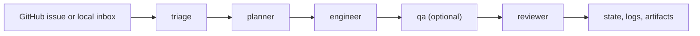

<div align="center">
  <h1>RepoAgents</h1>
  <p><strong>Install an AI maintainer team into any repo.</strong></p>
  <p>Issue-driven repository operations with Codex CLI, repo-local roles, and conservative safety defaults.</p>

  <p>
    <a href="./README.ko.md">한국어</a> ·
    <a href="./QUICKSTART.md">Quickstart</a> ·
    <a href="./docs/README.md">Docs</a> ·
    <a href="./examples">Examples</a>
  </p>

  <p>
    
    
    
    
    
    
  </p>
</div>

> RepoAgents installs prompts, policies, workflow scaffolding, and run-state into a repository, then coordinates a `triage -> planner -> engineer -> reviewer` pipeline around real issues instead of disposable chat context.

RepoAgents is inspired by the operating model behind OpenAI Symphony, but it does not include, embed, or depend on Symphony. It is an independent Python implementation with Codex CLI as the default execution backend.

## Why It Feels Different

| Most AI coding setups | RepoAgents |
| --- | --- |
| optimize for a chat session | optimize for ongoing repository operations |
| keep instructions outside the repo | keep roles, prompts, and policies in version control |
| start from ad hoc asks | start from issues, inboxes, and explicit events |
| lose context after the conversation | persist state, logs, and Markdown artifacts |
| make optimistic writes easy | default to human approval and conservative publication |

## How It Works



- `repoagents init` seeds the repository-local control plane.
- `repoagents run` executes the issue loop with Codex as the default worker runtime.
- `repoagents trigger`, `repoagents webhook`, and `repoagents dashboard` cover event-driven runs and operations visibility.

## Quickstart

### 1. Install tooling

Requirements:

- Python 3.12+
- [uv](https://docs.astral.sh/uv/)
- Codex CLI on `PATH`

```bash
git clone <your-fork-or-copy> RepoAgents
cd RepoAgents
uv sync --dev
codex --version
codex login
```

After `uv sync --dev`, the `repoagents` entrypoint is available at `.venv/bin/repoagents`, but that path is not added to your shell automatically. The examples in this repo use `uv run repoagents ...` because it works without activating the virtualenv.

If you want to call `repoagents` directly, use one of these options:

- activate the project virtualenv with `source .venv/bin/activate`
- run through uv with `uv run repoagents ...`
- install it as a global uv tool with `uv tool install -e /path/to/RepoAgents`

Also note that RepoAgents scaffolds target repositories with `repoagents init`; there is no `repoagents template create ...` command in this CLI.

### 2. Initialize a target repo

```bash
cd /path/to/your/repo
uv run repoagents init --preset python-library --tracker-repo owner/name
uv run repoagents doctor
```

Useful setup variations:

- `uv run repoagents init` starts the interactive setup flow.
- `uv run repoagents init --backend mock` seeds the repo with the deterministic mock backend.
- `uv run repoagents init --tracker-kind local_file --tracker-path issues.json` uses a local JSON inbox instead of GitHub.
- `uv run repoagents init --tracker-kind local_markdown --tracker-path issues` uses a local Markdown issue directory.
- local offline trackers can stage publication proposals under `.ai-repoagents/sync/<tracker>/issue-<id>/`.
- local Markdown trackers with writes enabled stage publication proposals under `.ai-repoagents/sync/local-markdown/issue-<id>/`.
- `uv run repoagents init --upgrade` inspects managed scaffold drift without overwriting local managed-file edits.

### Choosing a preset

Presets do not change the core `triage -> planner -> engineer -> reviewer` pipeline, and they do not lock you into a tracker or backend. They tune the initial repo-local prompts, policies, and workflow guidance so the default behavior matches the kind of repository you are installing RepoAgents into. If you pick the wrong one, you can re-run `repoagents init --preset <name> --upgrade` later.

| Preset | Best for | What it biases toward | Pick it when |
| --- | --- | --- | --- |
| `python-library` | Python packages, CLIs, APIs, and backend services | Small Python code changes, focused tests, packaging hygiene, and explicit API-surface notes | Most of the repo lives in `src/`, `tests/`, and `pyproject.toml`, or you want the safest default starting point |
| `web-app` | Frontend apps or full-stack repos with UI and deployment concerns | Focused component/route changes, visual-regression awareness, and careful handling of env/deploy config | The repo ships pages, assets, routes, or server/client code where UI breakage and config drift matter |
| `docs-only` | Documentation sites, handbook repos, specs, or example-heavy docs projects | Staying inside Markdown, docs tooling, examples, and copy/paste accuracy unless code edits are explicitly requested | The repository is primarily prose and reference material, and maintainers want code changes to stay exceptional |
| `research-project` | Notebook-heavy repos, experiment code, prototypes, and research workflows | Reproducibility, experiment notes, narrow changes, and caution around datasets or generated artifacts | The repo contains notebooks, one-off experiments, or generated outputs that should not be rewritten casually |

Practical rule of thumb:

- Start with `python-library` if the repo is mostly application or library code and you are unsure.
- Use `web-app` when browser/UI behavior is part of the review surface, not just implementation detail.
- Use `docs-only` when “do not wander into product code unless asked” is the main requirement.
- Use `research-project` when preserving experiment context matters more than keeping the tree tidy.

### 3. Dry-run the first pipeline

```bash
uv run repoagents run --dry-run
uv run repoagents run --once
uv run repoagents status
uv run repoagents dashboard
```

Production path:

1. Keep `llm.mode: codex`.
2. Point `tracker.repo` at a real GitHub repository.
3. Provide `GITHUB_TOKEN`.
4. Run `uv run repoagents run`.

## What `repoagents init` Installs

```text
.ai-repoagents/
  repoagents.yaml
  roles/
    triage.md
    planner.md
    engineer.md
    qa.md
    reviewer.md
  prompts/
    triage.txt.j2
    planner.txt.j2
    engineer.txt.j2
    qa.txt.j2
    reviewer.txt.j2
  policies/
    merge-policy.md
    scope-policy.md
  state/
    runs.json
AGENTS.md
WORKFLOW.md
.github/workflows/repoagents-check.yml
```

The operating model stays in the repo, so maintainers can inspect and evolve it with ordinary code review.

## Demo Paths

The examples are designed for local fixture issues and the mock backend. That keeps demos deterministic while preserving the production architecture.

Recommended first runs:

- `bash scripts/demo_python_lib.sh` for the default local issue pipeline.
- `bash scripts/demo_local_file_tracker.sh` for the simplest fully offline inbox flow.
- `bash scripts/demo_live_ops.sh` for the production-shaped GitHub REST rehearsal.
- `bash scripts/release_preflight.sh` for the real repository release gate before publishing.

<details>
<summary>Full example matrix</summary>

| Scenario | Command | What it shows |
| --- | --- | --- |
| Python library | `bash scripts/demo_python_lib.sh` | Full init, dry-run, single run, status, and dashboard flow |
| Web app | `bash scripts/demo_web_app.sh` | Same control plane with a different preset |
| Local file inbox | `bash scripts/demo_local_file_tracker.sh` | Offline JSON inbox without GitHub polling |
| Local file sync | `bash scripts/demo_local_file_sync.sh` | Offline JSON inbox plus staged sync proposals and `sync apply` |
| Local Markdown inbox | `bash scripts/demo_local_markdown_tracker.sh` | Fully offline Markdown issue execution |
| Local Markdown sync | `bash scripts/demo_local_markdown_sync.sh` | Offline Markdown inbox plus staged comment, branch, label, and draft-PR proposals |
| Docs maintainer pack | `bash scripts/demo_docs_maintainer_pack.sh` | Repo-local role, prompt, policy, and `AGENTS.md` overrides |
| QA role pack | `bash scripts/demo_qa_role_pack.sh` | Optional `qa` stage plus `qa.md` and `qa.json` artifacts |
| Webhook receiver | `bash scripts/demo_webhook_receiver.sh` | Local HTTP receiver that forwards GitHub-style POSTs |
| Signed webhook receiver | `bash scripts/demo_webhook_signature_receiver.sh` | `X-Hub-Signature-256` verification before dispatch |
| Live GitHub ops | `bash scripts/demo_live_ops.sh` | GitHub REST mode, `worktree`, file logging, offline `github smoke` rehearsal, and ops handoff bundle generation |
| Sandbox publish rollout | `bash scripts/demo_live_publish_sandbox.sh` | Stepwise `allow_write_comments` / `allow_open_pr` enablement with per-phase `github smoke` gates, a readiness bundle, and a deterministic single-issue execution rehearsal |
| Release rehearsal | `bash scripts/demo_release_rehearsal.sh` | Local annotated tag rehearsal, release preview/announce copy pack export, and build checksum capture |
| Release publish dry-run | `bash scripts/demo_release_publish_dry_run.sh` | Local version-bump rehearsal, asset build/smoke validation, and publish-command dry-run evidence |

</details>

<details>
<summary>Manual demo walkthrough</summary>

```bash
cd examples/python-lib
uv run repoagents init --preset python-library --fixture-issues issues.json --tracker-repo demo/python-lib
python3 - <<'PY'
from pathlib import Path
path = Path(".ai-repoagents/repoagents.yaml")
body = path.read_text()
path.write_text(body.replace("mode: codex", "mode: mock"))
PY
uv run repoagents doctor
uv run repoagents run --dry-run
uv run repoagents run --once
uv run repoagents status
uv run repoagents dashboard
```

</details>

## Trackers and Execution Modes

| Mode | Use when | Notes |
| --- | --- | --- |
| GitHub polling | You want continuous issue-driven operation on a real repository | Default long-running mode |
| `local_file` | You want a local JSON inbox | Good for deterministic offline demos, with optional sync staging under `.ai-repoagents/sync/local-file/` |
| `local_markdown` | You want local Markdown issues instead of GitHub | Fully local execution path, with optional sync staging under `.ai-repoagents/sync/local-markdown/` |
| `trigger` | You want to run one issue immediately | Skips waiting for the polling loop |
| `webhook` | You want event-driven execution from a payload | Supports `--dry-run` for validation first |

For staged local publish proposals:

- `uv run repoagents sync ls --issue 1`
- `uv run repoagents sync check --issue 1`
- `uv run repoagents sync repair --issue 1 --dry-run`
- `uv run repoagents sync health --issue 1 --format all`
- `uv run repoagents sync audit --format all`
- `uv run repoagents sync apply --issue 1 --tracker local-file --action comment --latest`
- `uv run repoagents sync apply --issue 1 --tracker local-markdown --action comment --latest`
- `uv run repoagents sync apply --issue 1 --tracker local-markdown --action pr-body --latest --bundle`
- `uv run repoagents sync show local-markdown/issue-1/<timestamp>-comment.md`
- `uv run repoagents clean --sync-applied --dry-run`

## Safety Defaults

- Merge mode defaults to `human_approval`.
- Auto-merge is never executed by the MVP.
- PR opening is disabled by default.
- `repoagents run --dry-run` previews likely files, policy restrictions, and blocked side effects without external writes.
- Secret-like files, workflow edits, auth-sensitive filenames, large deletions, and broad unplanned code changes are escalated or blocked.

## Documentation

| Area | English | Korean |
| --- | --- | --- |
| Overview | [README.md](./README.md) | [README.ko.md](./README.ko.md) |
| Quickstart | [QUICKSTART.md](./QUICKSTART.md) | [QUICKSTART.ko.md](./QUICKSTART.ko.md) |
| Docs index | [docs/README.md](./docs/README.md) | [docs/README.ko.md](./docs/README.ko.md) |
| Architecture | [docs/architecture.md](./docs/architecture.md) | [docs/architecture.ko.md](./docs/architecture.ko.md) |
| Extensions | [docs/extensions.md](./docs/extensions.md) | [docs/extensions.ko.md](./docs/extensions.ko.md) |
| Sync artifacts | [docs/sync.md](./docs/sync.md) | [docs/sync.ko.md](./docs/sync.ko.md) |
| Role packs | [docs/role-packs.md](./docs/role-packs.md) | [docs/role-packs.ko.md](./docs/role-packs.ko.md) |
| Runbook | [docs/runbook.md](./docs/runbook.md) | [docs/runbook.ko.md](./docs/runbook.ko.md) |
| Live GitHub ops | [docs/live-github-ops.md](./docs/live-github-ops.md) | [docs/live-github-ops.ko.md](./docs/live-github-ops.ko.md) |
| Sandbox publish rollout | [docs/live-github-sandbox-rollout.md](./docs/live-github-sandbox-rollout.md) | [docs/live-github-sandbox-rollout.ko.md](./docs/live-github-sandbox-rollout.ko.md) |
| Release process | [docs/release.md](./docs/release.md) | [docs/release.ko.md](./docs/release.ko.md) |
| Active queue | [docs/backlog/active-queue.md](./docs/backlog/active-queue.md) | - |

## Community

- Contributing guide: [CONTRIBUTING.md](./CONTRIBUTING.md)
- Security policy: [SECURITY.md](./SECURITY.md)
- Code of Conduct: [CODE_OF_CONDUCT.md](./CODE_OF_CONDUCT.md)
- Changelog: [CHANGELOG.md](./CHANGELOG.md)
- License: [LICENSE](./LICENSE)

<details>
<summary>Codex setup and smoke tests</summary>

RepoAgents defaults to `llm.mode: codex`, so verify Codex first:

```bash
codex --version
codex exec --help
codex login
```

Use `repoagents doctor` after initialization to confirm the configured Codex command is executable. It also checks GitHub auth and network reachability, writable runtime directories, managed template drift, the current `dashboard.report_freshness_policy` posture, whether raw sync/cleanup report exports were generated under a different embedded policy, and an aggregate report policy health summary that combines threshold posture with embedded-policy drift. When drift is detected, `doctor` now emits the same remediation guidance used by `status` and the dashboard.

Optional live smoke tests:

```bash
uv run pytest
CODEX_E2E=1 uv run pytest tests/test_codex_backend.py -k live_smoke -rs
GITHUB_E2E=1 REPOREPUBLIC_GITHUB_TEST_REPO=owner/name uv run pytest tests/test_tracker.py -k live_read_only -rs
REPOREPUBLIC_GITHUB_WRITE_E2E=1 REPOREPUBLIC_GITHUB_WRITE_TEST_REPO=owner/name REPOREPUBLIC_GITHUB_WRITE_TEST_ISSUE=123 uv run pytest tests/test_tracker.py -k live_comment_write -rs
REPOREPUBLIC_GITHUB_PR_E2E=1 REPOREPUBLIC_GITHUB_PR_TEST_REPO=owner/name REPOREPUBLIC_GITHUB_PR_TEST_ISSUE=123 uv run pytest tests/test_tracker.py -k live_draft_pr_publish -rs
```

The Codex smoke test is read-only, opt-in, and only runs when Codex CLI is installed and logged in. The baseline live GitHub tracker test is also read-only and requires `GITHUB_TOKEN`; set `REPOREPUBLIC_GITHUB_TEST_ISSUE=<number>` to pin a known issue. The write-path GitHub tests are separate opt-in checks and should only run against a dedicated sandbox repo/issue. The comment write test deletes its test comment after assertion. The draft PR test pushes a temporary branch, opens a draft PR, then closes the PR and deletes the branch during cleanup.

</details>

<details>
<summary>CLI surface</summary>

```bash
repoagents init
repoagents init --preset python-library
repoagents init --backend mock
repoagents init --preset web-app
repoagents init --preset docs-only
repoagents init --preset research-project
repoagents init --upgrade
repoagents doctor
repoagents run
repoagents run --dry-run
repoagents trigger 123 --dry-run
repoagents webhook --event issues --payload webhook.json --dry-run
repoagents status
repoagents retry 123
repoagents clean --dry-run
repoagents dashboard
repoagents dashboard --refresh-seconds 30
repoagents dashboard --format all
repoagents ops snapshot --archive
repoagents ops status
repoagents ops status --format all
repoagents github smoke
repoagents github smoke --format all
repoagents release preview
repoagents release preview --format all
repoagents release announce --format all
repoagents release check --format all
repoagents release assets --format all
repoagents sync health --issue 123 --format all
```

Helpful flags:

- `repoagents init --fixture-issues issues.json` drives local dry-runs from JSON fixtures.
- `repoagents init --tracker-repo owner/name` pins the GitHub repository slug.
- `repoagents init --upgrade --force` refreshes drifted managed files from the packaged scaffold.
- `repoagents doctor --format all` exports JSON and Markdown operator snapshots under `.ai-repoagents/reports/doctor.json` and `.ai-repoagents/reports/doctor.md`.
- `repoagents run --once` executes a single polling cycle and exits.
- `repoagents status --issue 123` inspects the latest persisted run for one issue.
- `repoagents status` also summarizes current report health, the active policy thresholds, an aggregate `policy_health` line, and the current ops snapshot index posture so operators can see both reporting health and handoff history posture without opening the dashboard. It warns when raw report exports still carry an older embedded policy. `status` and `doctor` now reuse the same related-report detail block shape as the sync/cleanup CLI, so drift warnings and remediation render consistently across operator surfaces.
- `repoagents status --format all` exports JSON and Markdown status snapshots under `.ai-repoagents/reports/status.json` and `.ai-repoagents/reports/status.md`.
- `repoagents retry 123` pushes the latest stored run back into the retry queue.
- `repoagents clean --dry-run` previews stale local workspace and artifact cleanup.
- `repoagents clean --sync-applied --dry-run` previews manifest-aware retention for `.ai-repoagents/sync-applied/`.
- `repoagents clean --sync-applied --dry-run --report --report-format all` exports machine-readable cleanup previews under `.ai-repoagents/reports/` and summarizes linked sync-audit drift counts in CLI output. Add `--show-remediation` to print the re-export guidance inline, or `--show-mismatches` to print linked sync-audit issue-filter mismatch warnings inline. When both flags are set, the CLI groups drift and mismatch details into one related-report block.
- `repoagents sync check` reports applied manifest integrity problems such as dangling entries, duplicate keys, and orphan archives.
- `repoagents sync repair --dry-run` previews manifest reconstruction and orphan adoption before writing.
- `repoagents sync health --format all` exports one combined operator snapshot for pending staged artifacts, applied manifest integrity, repair preview, cleanup preview, and linked raw report posture under `.ai-repoagents/reports/sync-health.json|md`. Add `--show-remediation` and `--show-mismatches` to print the same related-report detail blocks inline.
- `repoagents sync audit --format all` exports JSON and Markdown sync audit reports under `.ai-repoagents/reports/`, links matching cleanup preview/result exports, warns when a cleanup report was generated for a different `issue_filter`, records `policy_alignment` metadata for those related cleanup exports directly inside the raw report, adds a plain-text `related_reports.detail_summary` block for mismatch/drift/remediation reuse, and summarizes linked cleanup policy drift counts in CLI output. Add `--show-remediation` to print the same guidance inline, or `--show-mismatches` to print linked cleanup issue-filter mismatch warnings inline. When both flags are set, the CLI groups drift and mismatch details into one related-report block.
- `repoagents dashboard --format all` exports HTML, JSON, and Markdown snapshots together. The Markdown snapshot mirrors the CLI related-report detail block, the HTML `Cross references` panel exposes the same `mismatches / policy drifts / remediation` semantics directly, and the JSON export carries a ready-to-display `related_report_detail_summary` string for each report entry. When `.ai-repoagents/reports/ops-status.json` or `.ai-repoagents/reports/ops-brief.json` exists, the `Reports` section renders `Ops status` and `Ops brief` cards that cross-link the latest handoff posture with the incident brief.
- `repoagents ops snapshot` exports one incident-ready bundle directory with `doctor`, `status`, `dashboard`, `sync-audit`, bundle-local `sync-health`, bundle-local `ops-status`, bundle-local `ops-brief`, bundle-local `github-smoke` when the tracker is in live GitHub REST mode, bundle-local landing files `index.html` and `README.md`, and `bundle.json` / `bundle.md` manifests. The `ops-brief` export is the operator-facing landing summary for the handoff and the landing page links that brief directly to the rest of the bundle. Add `--include-cleanup-preview` to generate a cleanup preview inside the bundle, `--include-cleanup-result` to copy the latest existing cleanup result, `--include-sync-check` to add a dedicated applied-manifest integrity snapshot, `--include-sync-repair-preview` to add a dry-run repair preview, and `--archive` to pack the completed handoff into a `.tar.gz` file with checksum output. Every run also refreshes `.ai-repoagents/reports/ops/latest.json|md`, `.ai-repoagents/reports/ops/history.json|md`, `.ai-repoagents/reports/ops-status.json|md`, `.ai-repoagents/reports/ops-brief.json|md`, `.ai-repoagents/reports/sync-health.json|md`, and, for live GitHub REST trackers, `.ai-repoagents/reports/github-smoke.json|md` so automation and dashboard/report surfaces can find the newest handoff from one place even when the bundle directory lives elsewhere. Use `--history-limit` to cap retained index entries for one run, and `--prune-history` to delete dropped managed bundle/archive paths under `.ai-repoagents/reports/ops/`. Repo default retention lives in `cleanup.ops_snapshot_keep_entries` and `cleanup.ops_snapshot_prune_managed`.
- `repoagents ops status` reads `.ai-repoagents/reports/ops/latest.*`, `.ai-repoagents/reports/ops/history.*`, and the latest indexed `bundle.json` to print one operator-facing summary for handoff posture, latest bundle health, component summaries, recent history, landing paths, and related report posture. `repoagents ops status --format all` exports the same snapshot to `.ai-repoagents/reports/ops-status.json` and `.ai-repoagents/reports/ops-status.md`.
- `repoagents github smoke` probes live GitHub REST readiness against `tracker.repo`, samples open issues, and reports publish preflight posture for comment and draft-PR writes. In REST mode, `GITHUB_TOKEN` is the real requirement; `gh auth` alone is not enough for RepoAgents's API calls.
- `repoagents github smoke` now also folds repo metadata permissions into publish readiness, so a repo that reports `permissions.push=false` will stay in warning state for draft-PR publish even if token and origin preflight pass.
- `repoagents github smoke` also inspects default-branch policy. Unprotected default branches, missing PR review requirements, missing required status checks, or unreadable branch protection details keep draft-PR publish in warning state under `--require-write-ready`.
- `repoagents release preview` prepares a maintainer-facing public release dry-run even when the repo has not been bootstrapped with `repoagents init`. It infers the next patch tag when the current version already has a dated changelog section, exports `.ai-repoagents/reports/release-preview.json|md`, and writes a ready-to-use GitHub release notes file at `.ai-repoagents/reports/release-notes-v<version>.md`.
- `repoagents release announce` builds the copy pack that sits on top of the release preview: `.ai-repoagents/reports/release-announce.json|md` plus `announcement-v<version>.md`, `discussion-v<version>.md`, `social-v<version>.md`, and `release-cut-v<version>.md`.
- `repoagents release check --format all` is the default pre-publish gate. It runs release preview, announcement copy-pack generation, `uv run pytest -q`, `uv build`, temporary-wheel smoke install, and OSS governance/CI file checks, then exports `.ai-repoagents/reports/release-checklist.json|md` plus the companion release reports. `bash scripts/release_preflight.sh` is the one-line wrapper for the same flow.
- `repoagents release assets` validates the local dist artifacts for the inferred release target and exports `.ai-repoagents/reports/release-assets.json|md` plus `release-assets-v<tag>.md`. Add `--build --smoke-install` when you want the command to rebuild wheel/sdist and verify a temporary-wheel install before publishing to GitHub Releases or TestPyPI.
- Live GitHub branch publish now stages from the repository default branch when GitHub metadata reports one, instead of inheriting the current local branch by default.

</details>

<details>
<summary>Dry-run preview</summary>

`repoagents run --dry-run` does not perform external writes. It previews:

- which issues are runnable
- which roles would invoke Codex
- likely files from the planner step
- policy restrictions such as human approval and blocked PR writes
- which external side effects are suppressed

Example output shape:

```text
Issue #102: Improve README quickstart
  selected: True
  backend: codex
  roles: triage, planner, engineer, reviewer
  likely_files: README.md, QUICKSTART.md
  policy: Merge policy default=human_approval. PR open allowed=False.
  blocked_side_effects: Issue comments blocked in dry-run; PR opening blocked in dry-run; ...
```

</details>

<details>
<summary>Example config</summary>

RepoAgents reads `.ai-repoagents/repoagents.yaml` and validates it with Pydantic.

```yaml
tracker:
  kind: github
  repo: owner/name
  poll_interval_seconds: 60
workspace:
  root: ./.ai-repoagents/workspaces
  strategy: copy
  dirty_policy: warn
agent:
  max_concurrent_runs: 2
  max_turns: 20
  role_timeout_seconds: 900
  retry_limit: 3
  base_retry_seconds: 30
  debug_artifacts: false
roles:
  enabled:
    - triage
    - planner
    - engineer
    - reviewer
merge_policy:
  mode: human_approval
auto_merge:
  allowed_types:
    - docs
    - tests
safety:
  allow_write_comments: true
  allow_open_pr: false
llm:
  mode: codex
codex:
  command: codex
  model: gpt-5.4
  use_agents_md: true
logging:
  json: true
  level: INFO
  file_enabled: false
  directory: ./.ai-repoagents/logs
```

Key sections:

- `tracker`: GitHub issue polling, GitHub fixture replay, or a local offline inbox.
- `workspace`: isolated issue workspaces under `.ai-repoagents/workspaces`, with `copy` and `worktree` strategies plus dirty-working-tree policy.
- `agent`: concurrency, timeout, retry, and optional debug artifact capture.
- `roles`: the ordered pipeline; the core order stays `triage -> planner -> engineer -> reviewer`, and optional built-in roles such as `qa` can be inserted between `engineer` and `reviewer`.
- `safety` and `merge_policy`: external write controls plus `comment_only`, `draft_pr`, and `human_approval` publication stages.
- `llm` and `codex`: backend selection and Codex CLI command settings.
- `logging`: stderr formatting plus optional JSONL file logging under `.ai-repoagents/logs`.

</details>

<details>
<summary>AGENTS.md, roles, policies, and dashboard</summary>

RepoAgents controls Codex behavior through repository files rather than a hidden prompt:

- `AGENTS.md` gives repo-level instructions Codex can read directly.
- `.ai-repoagents/roles/*.md` defines the charter for each role.
- `.ai-repoagents/prompts/*.txt.j2` renders role-specific prompts.
- `.ai-repoagents/policies/*.md` encodes merge and scope guardrails.
- `WORKFLOW.md` explains the operator-facing pipeline.

`repoagents dashboard` generates local exports under `.ai-repoagents/dashboard/` with recent run summaries, artifact links, failure reasons, search and status filters, optional timed reload, JSON or Markdown snapshots for sharing or automation, sync retention views that surface prunable groups, prunable bytes, and repair-needed applied archives, an `Ops snapshots` section that reads `.ai-repoagents/reports/ops/latest.*` and `history.*`, and a `Reports` section that links directly to sync audit, sync health, GitHub smoke, cleanup, ops status, and ops brief exports under `.ai-repoagents/reports/`. The ops section surfaces the latest indexed handoff bundle status, archive presence, bounded history size, dropped entry count, landing links, and the current brief headline/severity so operators can verify whether incident bundles are being retained or pruned as expected. The GitHub smoke card summarizes live repo access, default-branch policy, sampled issue context, and publish readiness when the tracker runs in live GitHub REST mode, and it cross-links into the handoff bundle through ops status and ops brief. The sync audit card now also shows applied manifest integrity breakdowns such as finding counts and affected issue samples, cross-links to related cleanup cards, issue-filter mismatch warnings for linked cleanup reports, and action-oriented hints for common integrity findings. Cleanup report cards also show freshness and age so stale exports stand out, the report summary metrics aggregate both overall report freshness and cleanup-specific freshness, those freshness aggregates now carry `issues/attention/clean` severity plus a short reason, and `dashboard.report_freshness_policy` lets each repo tune how stale, unknown, aging, and future counts escalate. The dashboard exports now also persist the effective policy thresholds as explicit metadata so shared JSON or Markdown snapshots keep the exact severity inputs, and each report card carries that same policy context directly in its detail view. Dashboard report cards now also compare that live policy context with any embedded raw-report policy metadata and surface `Policy drift reports` when old exports no longer match current config. Cross-reference panels now carry related-report policy drift notes as well, so linked sync audit and cleanup cards show when the other side was rendered under an older threshold. That policy drift now also feeds the dashboard-only report summary severity, so the hero can move to `attention` even when freshness counts are still clean. Dashboard cards, `doctor`, and `status` now share the same remediation guidance for that drift, including the recommended re-export commands, and the raw `sync-audit` / `cleanup` exports now embed that same remediation text in both JSON and Markdown bodies. The hero banner mirrors that severity so operators land on a top-level report-health summary before scanning the detailed cards. Dedicated `Aging reports`, `Future reports`, `Unknown freshness reports`, `Policy drift reports`, `Cleanup aging reports`, `Cleanup future reports`, `Cleanup unknown freshness reports`, and `Stale cleanup reports` cards call out the current aging, future, unknown, policy-drift, cleanup-aging, cleanup-future, cleanup-unknown, and stale counts.

</details>

<details>
<summary>Current limitations and roadmap</summary>

Current limitations:

- GitHub integration is issue-focused; branch and PR creation remain intentionally conservative.
- local offline trackers stage proposals under `.ai-repoagents/sync/` instead of writing directly to hosted systems.
- The Codex backend expects a working `codex exec` installation and login state.
- The mock backend is deterministic but only applies small heuristic edits.
- `copy` remains the default workspace strategy; `worktree` requires the target repo to be a valid Git work tree.
- The dashboard is still static HTML; it supports client-side filtering and timed reload, but not server-push sync or multi-user hosting.

Roadmap:

- richer GitHub write actions once branch management is in place
- more precise diff and policy analysis
- additional tracker adapters beyond GitHub
- more runnable tracker-mode examples beyond the current GitHub and local inbox demos
- more built-in role-pack examples beyond the current QA gate demo
- richer live ops blueprints beyond the current GitHub REST example
- deeper role customization and extension packs

</details>
