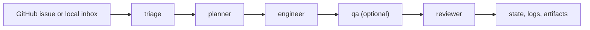

<div align="center">
  <h1>RepoRepublic</h1>
  <p><strong>Install an AI maintainer team into any repo.</strong></p>
  <p>Issue-driven repository operations with Codex CLI, repo-local roles, and conservative safety defaults.</p>

  <p>
    <a href="./README.ko.md">한국어</a> ·
    <a href="./QUICKSTART.md">Quickstart</a> ·
    <a href="./docs/README.md">Docs</a> ·
    <a href="./examples">Examples</a>
  </p>

  <p>
    
    
    
    
    
    
  </p>
</div>

> RepoRepublic installs prompts, policies, workflow scaffolding, and run-state into a repository, then coordinates a `triage -> planner -> engineer -> reviewer` pipeline around real issues instead of disposable chat context.

RepoRepublic is inspired by the operating model behind OpenAI Symphony, but it does not include, embed, or depend on Symphony. It is an independent Python implementation with Codex CLI as the default execution backend.

## Why It Feels Different

| Most AI coding setups | RepoRepublic |
| --- | --- |
| optimize for a chat session | optimize for ongoing repository operations |
| keep instructions outside the repo | keep roles, prompts, and policies in version control |
| start from ad hoc asks | start from issues, inboxes, and explicit events |
| lose context after the conversation | persist state, logs, and Markdown artifacts |
| make optimistic writes easy | default to human approval and conservative publication |

## How It Works



- `republic init` seeds the repository-local control plane.
- `republic run` executes the issue loop with Codex as the default worker runtime.
- `republic trigger`, `republic webhook`, and `republic dashboard` cover event-driven runs and operations visibility.

## Quickstart

### 1. Install tooling

Requirements:

- Python 3.12+
- [uv](https://docs.astral.sh/uv/)
- Codex CLI on `PATH`

```bash
git clone <your-fork-or-copy> RepoRepublic
cd RepoRepublic
uv sync --dev
codex --version
codex login
```

### 2. Initialize a target repo

```bash
cd /path/to/your/repo
uv run republic init --preset python-library --tracker-repo owner/name
uv run republic doctor
```

Useful setup variations:

- `uv run republic init` starts the interactive setup flow.
- `uv run republic init --backend mock` seeds the repo with the deterministic mock backend.
- `uv run republic init --tracker-kind local_file --tracker-path issues.json` uses a local JSON inbox instead of GitHub.
- `uv run republic init --tracker-kind local_markdown --tracker-path issues` uses a local Markdown issue directory.
- local offline trackers can stage publication proposals under `.ai-republic/sync/<tracker>/issue-<id>/`.
- local Markdown trackers with writes enabled stage publication proposals under `.ai-republic/sync/local-markdown/issue-<id>/`.
- `uv run republic init --upgrade` inspects managed scaffold drift without overwriting local managed-file edits.

### 3. Dry-run the first pipeline

```bash
uv run republic run --dry-run
uv run republic run --once
uv run republic status
uv run republic dashboard
```

Production path:

1. Keep `llm.mode: codex`.
2. Point `tracker.repo` at a real GitHub repository.
3. Provide `GITHUB_TOKEN`.
4. Run `uv run republic run`.

## What `republic init` Installs

```text
.ai-republic/
  reporepublic.yaml
  roles/
    triage.md
    planner.md
    engineer.md
    qa.md
    reviewer.md
  prompts/
    triage.txt.j2
    planner.txt.j2
    engineer.txt.j2
    qa.txt.j2
    reviewer.txt.j2
  policies/
    merge-policy.md
    scope-policy.md
  state/
    runs.json
AGENTS.md
WORKFLOW.md
.github/workflows/republic-check.yml
```

The operating model stays in the repo, so maintainers can inspect and evolve it with ordinary code review.

## Demo Paths

The examples are designed for local fixture issues and the mock backend. That keeps demos deterministic while preserving the production architecture.

| Scenario | Command | What it shows |
| --- | --- | --- |
| Python library | `bash scripts/demo_python_lib.sh` | Full init, dry-run, single run, status, and dashboard flow |
| Web app | `bash scripts/demo_web_app.sh` | Same control plane with a different preset |
| Local file inbox | `bash scripts/demo_local_file_tracker.sh` | Offline JSON inbox without GitHub polling |
| Local file sync | `bash scripts/demo_local_file_sync.sh` | Offline JSON inbox plus staged sync proposals and `sync apply` |
| Local Markdown inbox | `bash scripts/demo_local_markdown_tracker.sh` | Fully offline Markdown issue execution |
| Local Markdown sync | `bash scripts/demo_local_markdown_sync.sh` | Offline Markdown inbox plus staged comment, branch, label, and draft-PR proposals |
| Docs maintainer pack | `bash scripts/demo_docs_maintainer_pack.sh` | Repo-local role, prompt, policy, and `AGENTS.md` overrides |
| QA role pack | `bash scripts/demo_qa_role_pack.sh` | Optional `qa` stage plus `qa.md` and `qa.json` artifacts |
| Webhook receiver | `bash scripts/demo_webhook_receiver.sh` | Local HTTP receiver that forwards GitHub-style POSTs |
| Signed webhook receiver | `bash scripts/demo_webhook_signature_receiver.sh` | `X-Hub-Signature-256` verification before dispatch |
| Live GitHub ops | `bash scripts/demo_live_ops.sh` | GitHub REST mode, `worktree`, file logging, and timed dashboard reload |

<details>
<summary>Manual demo walkthrough</summary>

```bash
cd examples/python-lib
uv run republic init --preset python-library --fixture-issues issues.json --tracker-repo demo/python-lib
python3 - <<'PY'
from pathlib import Path
path = Path(".ai-republic/reporepublic.yaml")
body = path.read_text()
path.write_text(body.replace("mode: codex", "mode: mock"))
PY
uv run republic doctor
uv run republic run --dry-run
uv run republic run --once
uv run republic status
uv run republic dashboard
```

</details>

## Trackers and Execution Modes

| Mode | Use when | Notes |
| --- | --- | --- |
| GitHub polling | You want continuous issue-driven operation on a real repository | Default long-running mode |
| `local_file` | You want a local JSON inbox | Good for deterministic offline demos, with optional sync staging under `.ai-republic/sync/local-file/` |
| `local_markdown` | You want local Markdown issues instead of GitHub | Fully local execution path, with optional sync staging under `.ai-republic/sync/local-markdown/` |
| `trigger` | You want to run one issue immediately | Skips waiting for the polling loop |
| `webhook` | You want event-driven execution from a payload | Supports `--dry-run` for validation first |

For staged local publish proposals:

- `uv run republic sync ls --issue 1`
- `uv run republic sync apply --issue 1 --tracker local-file --action comment --latest`
- `uv run republic sync apply --issue 1 --tracker local-markdown --action comment --latest`
- `uv run republic sync apply --issue 1 --tracker local-markdown --action pr-body --latest --bundle`
- `uv run republic sync show local-markdown/issue-1/<timestamp>-comment.md`
- `uv run republic clean --sync-applied --dry-run`

## Safety Defaults

- Merge mode defaults to `human_approval`.
- Auto-merge is never executed by the MVP.
- PR opening is disabled by default.
- `republic run --dry-run` previews likely files, policy restrictions, and blocked side effects without external writes.
- Secret-like files, workflow edits, auth-sensitive filenames, large deletions, and broad unplanned code changes are escalated or blocked.

## Documentation

| Area | English | Korean |
| --- | --- | --- |
| Overview | [README.md](./README.md) | [README.ko.md](./README.ko.md) |
| Quickstart | [QUICKSTART.md](./QUICKSTART.md) | [QUICKSTART.ko.md](./QUICKSTART.ko.md) |
| Docs index | [docs/README.md](./docs/README.md) | [docs/README.ko.md](./docs/README.ko.md) |
| Architecture | [docs/architecture.md](./docs/architecture.md) | [docs/architecture.ko.md](./docs/architecture.ko.md) |
| Extensions | [docs/extensions.md](./docs/extensions.md) | [docs/extensions.ko.md](./docs/extensions.ko.md) |
| Sync artifacts | [docs/sync.md](./docs/sync.md) | [docs/sync.ko.md](./docs/sync.ko.md) |
| Role packs | [docs/role-packs.md](./docs/role-packs.md) | [docs/role-packs.ko.md](./docs/role-packs.ko.md) |
| Runbook | [docs/runbook.md](./docs/runbook.md) | [docs/runbook.ko.md](./docs/runbook.ko.md) |
| Live GitHub ops | [docs/live-github-ops.md](./docs/live-github-ops.md) | [docs/live-github-ops.ko.md](./docs/live-github-ops.ko.md) |
| Backlog queue | [docs/backlog/issue-queue.md](./docs/backlog/issue-queue.md) | - |

<details>
<summary>Codex setup and smoke tests</summary>

RepoRepublic defaults to `llm.mode: codex`, so verify Codex first:

```bash
codex --version
codex exec --help
codex login
```

Use `republic doctor` after initialization to confirm the configured Codex command is executable. It also checks GitHub auth and network reachability, writable runtime directories, and managed template drift.

Optional live smoke tests:

```bash
uv run pytest
CODEX_E2E=1 uv run pytest tests/test_codex_backend.py -k live_smoke -rs
GITHUB_E2E=1 REPOREPUBLIC_GITHUB_TEST_REPO=owner/name uv run pytest tests/test_tracker.py -k live_read_only -rs
```

The Codex smoke test is read-only, opt-in, and only runs when Codex CLI is installed and logged in. The live GitHub tracker test is also read-only and requires `GITHUB_TOKEN`; set `REPOREPUBLIC_GITHUB_TEST_ISSUE=<number>` to pin a known issue.

</details>

<details>
<summary>CLI surface</summary>

```bash
republic init
republic init --preset python-library
republic init --backend mock
republic init --preset web-app
republic init --preset docs-only
republic init --preset research-project
republic init --upgrade
republic doctor
republic run
republic run --dry-run
republic trigger 123 --dry-run
republic webhook --event issues --payload webhook.json --dry-run
republic status
republic retry 123
republic clean --dry-run
republic dashboard
republic dashboard --refresh-seconds 30
republic dashboard --format all
```

Helpful flags:

- `republic init --fixture-issues issues.json` drives local dry-runs from JSON fixtures.
- `republic init --tracker-repo owner/name` pins the GitHub repository slug.
- `republic init --upgrade --force` refreshes drifted managed files from the packaged scaffold.
- `republic run --once` executes a single polling cycle and exits.
- `republic status --issue 123` inspects the latest persisted run for one issue.
- `republic retry 123` pushes the latest stored run back into the retry queue.
- `republic clean --dry-run` previews stale local workspace and artifact cleanup.
- `republic clean --sync-applied --dry-run` previews manifest-aware retention for `.ai-republic/sync-applied/`.
- `republic dashboard --format all` exports HTML, JSON, and Markdown snapshots together.

</details>

<details>
<summary>Dry-run preview</summary>

`republic run --dry-run` does not perform external writes. It previews:

- which issues are runnable
- which roles would invoke Codex
- likely files from the planner step
- policy restrictions such as human approval and blocked PR writes
- which external side effects are suppressed

Example output shape:

```text
Issue #102: Improve README quickstart
  selected: True
  backend: codex
  roles: triage, planner, engineer, reviewer
  likely_files: README.md, QUICKSTART.md
  policy: Merge policy default=human_approval. PR open allowed=False.
  blocked_side_effects: Issue comments blocked in dry-run; PR opening blocked in dry-run; ...
```

</details>

<details>
<summary>Example config</summary>

RepoRepublic reads `.ai-republic/reporepublic.yaml` and validates it with Pydantic.

```yaml
tracker:
  kind: github
  repo: owner/name
  poll_interval_seconds: 60
workspace:
  root: ./.ai-republic/workspaces
  strategy: copy
  dirty_policy: warn
agent:
  max_concurrent_runs: 2
  max_turns: 20
  role_timeout_seconds: 900
  retry_limit: 3
  base_retry_seconds: 30
  debug_artifacts: false
roles:
  enabled:
    - triage
    - planner
    - engineer
    - reviewer
merge_policy:
  mode: human_approval
auto_merge:
  allowed_types:
    - docs
    - tests
safety:
  allow_write_comments: true
  allow_open_pr: false
llm:
  mode: codex
codex:
  command: codex
  model: gpt-5.4
  use_agents_md: true
logging:
  json: true
  level: INFO
  file_enabled: false
  directory: ./.ai-republic/logs
```

Key sections:

- `tracker`: GitHub issue polling, GitHub fixture replay, or a local offline inbox.
- `workspace`: isolated issue workspaces under `.ai-republic/workspaces`, with `copy` and `worktree` strategies plus dirty-working-tree policy.
- `agent`: concurrency, timeout, retry, and optional debug artifact capture.
- `roles`: the ordered pipeline; the core order stays `triage -> planner -> engineer -> reviewer`, and optional built-in roles such as `qa` can be inserted between `engineer` and `reviewer`.
- `safety` and `merge_policy`: external write controls plus `comment_only`, `draft_pr`, and `human_approval` publication stages.
- `llm` and `codex`: backend selection and Codex CLI command settings.
- `logging`: stderr formatting plus optional JSONL file logging under `.ai-republic/logs`.

</details>

<details>
<summary>AGENTS.md, roles, policies, and dashboard</summary>

RepoRepublic controls Codex behavior through repository files rather than a hidden prompt:

- `AGENTS.md` gives repo-level instructions Codex can read directly.
- `.ai-republic/roles/*.md` defines the charter for each role.
- `.ai-republic/prompts/*.txt.j2` renders role-specific prompts.
- `.ai-republic/policies/*.md` encodes merge and scope guardrails.
- `WORKFLOW.md` explains the operator-facing pipeline.

`republic dashboard` generates local exports under `.ai-republic/dashboard/` with recent run summaries, artifact links, failure reasons, search and status filters, optional timed reload, and JSON or Markdown snapshots for sharing or automation.

</details>

<details>
<summary>Current limitations and roadmap</summary>

Current limitations:

- GitHub integration is issue-focused; branch and PR creation remain intentionally conservative.
- local offline trackers stage proposals under `.ai-republic/sync/` instead of writing directly to hosted systems.
- The Codex backend expects a working `codex exec` installation and login state.
- The mock backend is deterministic but only applies small heuristic edits.
- `copy` remains the default workspace strategy; `worktree` requires the target repo to be a valid Git work tree.
- The dashboard is still static HTML; it supports client-side filtering and timed reload, but not server-push sync or multi-user hosting.

Roadmap:

- richer GitHub write actions once branch management is in place
- more precise diff and policy analysis
- additional tracker adapters beyond GitHub
- more runnable tracker-mode examples beyond the current GitHub and local inbox demos
- more built-in role-pack examples beyond the current QA gate demo
- richer live ops blueprints beyond the current GitHub REST example
- deeper role customization and extension packs

</details>
