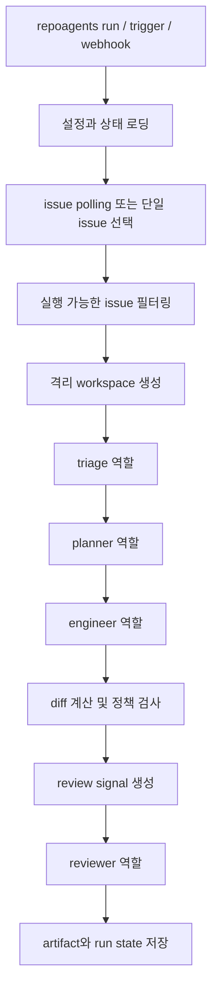

# 아키텍처

한국어 문서입니다. 영문 원문은 [architecture.md](./architecture.md)에서 볼 수 있습니다.

RepoAgents는 저장소 내부 제어 파일을 설치하고, 그 위에서 이슈 기반 유지보수 실행을 조정하는 Python 오케스트레이션 프레임워크입니다.

## 설계 목표

- Symphony wrapper가 아닌 독립 구현
- Codex CLI를 기본 worker 엔진으로 사용
- 테스트와 로컬 데모를 위한 결정적 fake Codex helper 제공
- 유지보수자가 직접 검토 가능한 저장소 로컬 프롬프트와 정책
- 보수적인 human approval 기본값

## 모듈 경계

```text
src/repoagents/
  cli/            Typer 명령과 운영자 출력
  config/         YAML 로딩, 검증, 경로 해석
  dashboard.py    정적 HTML 운영 대시보드 렌더러
  tracker/        GitHub issue adapter 추상화
  orchestrator/   polling loop, retry, 상태 복구, 스케줄링
  roles/          triage / planner / engineer / reviewer 인터페이스
  backend/        Codex CLI runner
  prompts/        Jinja 기반 프롬프트 렌더링
  testing/        테스트와 데모용 결정적 fake Codex helper
  workspace/      이슈별 격리 작업공간 준비
  policies/       diff guardrail과 human-approval 규칙
  models/         명시적 issue, 상태, 역할 결과 스키마
  logging/        JSON 가능 로깅 설정
  utils/          artifact, diff, 파일 헬퍼, repo context
  templates/      `repoagents init`이 생성하는 파일
```

## 제어 평면 파일

`repoagents init`이 설치하는 파일:

- `.ai-repoagents/repoagents.yaml`: 런타임 설정
- `.ai-repoagents/roles/*.md`: 역할 정의서
- `.ai-repoagents/prompts/*.txt.j2`: 역할 프롬프트
- `.ai-repoagents/policies/*.md`: 가드레일
- `AGENTS.md`: Codex가 읽는 저장소 지침
- `WORKFLOW.md`: 운영자용 파이프라인 요약

이 파일들은 런타임 계약의 일부입니다. RepoAgents는 숨겨진 에이전트 규칙을 하드코딩하는 대신 이 파일들로 프롬프트를 렌더링합니다.

## 런타임 흐름



`repoagents run`은 장기 실행 polling 진입점입니다. `repoagents trigger <issue-id>`는 polling을 우회하고 특정 이슈 하나를 즉시 실행합니다. `repoagents webhook --event ... --payload ...`는 GitHub webhook payload를 파싱해 단일 이슈를 고른 뒤, 같은 single-issue 실행 경로를 재사용합니다.

## 백엔드

### Codex backend

- 기본 운영 백엔드
- 역할 프롬프트를 렌더링함
- JSON schema 파일을 작성함
- `codex exec`를 호출함
- 마지막 JSON 메시지를 typed Pydantic model로 파싱함

실제 worker runtime은 RepoAgents 밖에 있습니다. RepoAgents는 오케스트레이션하고, Codex가 실행합니다.

## 테스트 helper

- `repoagents.testing.fake_codex`는 테스트와 로컬 데모를 위한 결정적 fake Codex helper를 제공합니다
- 역할 결과를 시뮬레이션하고, `engineer` 단계에서 작은 휴리스틱 파일 변경을 적용하고, 로컬 shim을 통해 구조화된 JSON을 돌려줄 수 있습니다
- 저장소에 포함된 demo script는 `codex.command`를 이 shim으로 바꿔서 오프라인 walkthrough를 반복 가능하게 유지합니다

## 상태 모델

실행 상태는 version 필드를 포함한 `.ai-repoagents/state/runs.json`에 저장됩니다.

각 issue record가 추적하는 정보:

- `run_id`
- `fingerprint`
- `status`
- `current_role`
- `attempts`
- `next_retry_at`
- `last_error`
- artifact 경로

프로세스가 재시작되면 진행 중이던 run은 `retry_pending`으로 바뀌어 오케스트레이터가 안전하게 복구할 수 있습니다.

## 안전 모델

- `--dry-run`에서는 외부 쓰기 차단
- 머지 모드는 항상 `human_approval`
- secret 유사 파일, CI/CD 변경, auth 민감 경로, 대규모 삭제를 guardrail이 감지
- reviewer prompt와 fake Codex 테스트 helper는 모두 diff/test/scope review signal을 사용함
- 정책 위반이 있으면 reviewer 결과를 `request_changes`로 덮어쓸 수 있음

## Workspace isolation

RepoAgents는 `.ai-repoagents/workspaces/issue-<id>/<run-id>/repo` 아래에서 두 가지 workspace 전략을 지원합니다.

- `copy`: 저장소를 격리 작업공간으로 복사
- `worktree`: 실행마다 분리된 `git worktree` checkout 생성

기본값을 여전히 copy로 두는 이유:

- 기존 Git worktree 구성에 의존하지 않음
- 정리와 검사 경로가 단순함
- 테스트에서 결정적임

저장소가 이미 Git work tree이고 복사 비용이 큰 경우에는 `workspace.strategy: worktree`를 사용할 수 있습니다.
