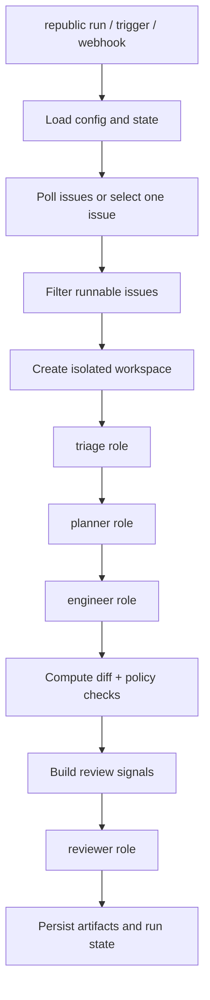

# Architecture

RepoRepublic is a Python orchestration framework that installs repository-local control files and then coordinates issue-driven maintenance runs.

## Design goals

- independent implementation, not a Symphony wrapper
- Codex CLI as the default worker engine
- deterministic mock backend for tests and local demos
- repo-local prompts and policies that maintainers can inspect
- conservative human-approval defaults

## Module boundaries

```text
src/reporepublic/
  cli/            Typer commands and operator-facing output
  config/         YAML loading, validation, and path resolution
  dashboard.py    static HTML operations dashboard renderer
  tracker/        GitHub issue adapter abstraction
  orchestrator/   polling loop, retries, state recovery, scheduling
  roles/          triage / planner / engineer / reviewer interfaces
  backend/        Codex CLI runner and mock backend
  prompts/        Jinja-based prompt rendering
  workspace/      isolated per-issue workspace preparation
  policies/       diff guardrails and human-approval rules
  models/         explicit issue, state, and role result schemas
  logging/        JSON-capable logging setup
  utils/          artifacts, diffing, file helpers, repo context
  templates/      files generated by `republic init`
```

## Control plane files

`republic init` installs:

- `.ai-republic/reporepublic.yaml`: runtime config
- `.ai-republic/roles/*.md`: role charters
- `.ai-republic/prompts/*.txt.j2`: role prompts
- `.ai-republic/policies/*.md`: guardrails
- `AGENTS.md`: Codex-readable repo instructions
- `WORKFLOW.md`: maintainer-facing flow summary

Those files are part of the runtime contract. RepoRepublic renders prompts from them instead of hard-coding hidden agent behavior.

## Runtime flow



`republic run` is the long-running polling entrypoint. `republic trigger <issue-id>` bypasses polling and runs one issue immediately. `republic webhook --event ... --payload ...` parses a GitHub webhook payload, selects one issue, and then reuses the same single-issue execution path.

## Backends

### Codex backend

- default production backend
- renders a role prompt
- writes a JSON schema file
- invokes `codex exec`
- parses the final JSON message into a typed Pydantic model

The worker runtime lives outside RepoRepublic. RepoRepublic orchestrates, Codex executes.

### Mock backend

- deterministic for tests and local demos
- simulates role outputs
- applies small heuristic file changes in `engineer`
- derives reviewer notes from diff-based review signals
- allows end-to-end runs without network or Codex access

## State model

Run state is persisted to a versioned `.ai-republic/state/runs.json`.

Each issue record tracks:

- `run_id`
- `fingerprint`
- `status`
- `current_role`
- `attempts`
- `next_retry_at`
- `last_error`
- artifact paths

On process restart, in-progress runs are converted to `retry_pending` so the orchestrator can safely recover.

## Safety model

- external writes are blocked in `--dry-run`
- merge mode is always `human_approval`
- guardrails flag secret-like files, CI/CD changes, auth-sensitive paths, and large deletions
- reviewer prompts and the mock backend both receive derived diff/test/scope review signals
- reviewer output can be overridden to `request_changes` when policy violations appear

## Workspace isolation

RepoRepublic supports two workspace strategies under `.ai-republic/workspaces/issue-<id>/<run-id>/repo`:

- `copy`: copies the repository into an isolated workspace
- `worktree`: creates a detached `git worktree` checkout for the run

Why `copy` remains the default:

- no dependency on an existing Git worktree setup
- simple cleanup and inspection
- deterministic for tests

Use `worktree` when the target repository is already a Git work tree and clone size makes copying too expensive.
